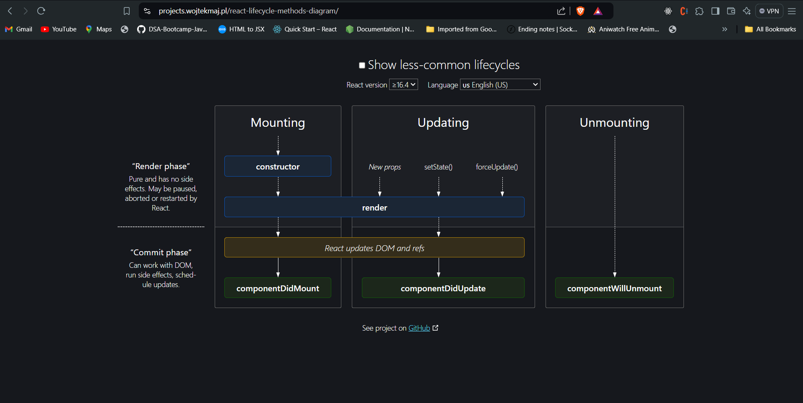
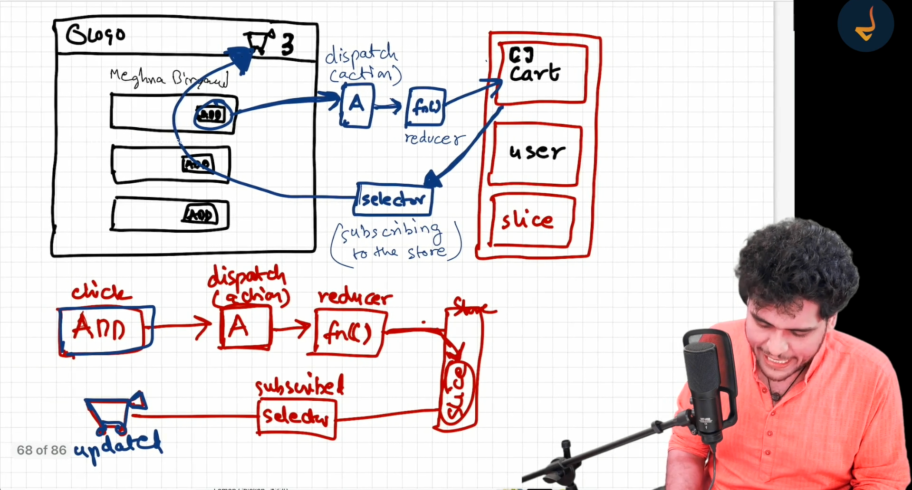

// Namaste React

# Parcel
-Dev Build
-Local Server
-HMR = Hot Module Replacement
-uses the file watching algorithm - writtern in C++
-Caching - Faster Builds
-Image Optimization
-Minification
-Bundling
-Compress
-Consistence Hashing
-code Spliting
-Differential Bundling -support of older browsers

# example
```js
const root  = ReactDOM.createRoot(document.getElementById("root"));

//react element
const heading = <h1 id="heading" tabIndex="32">hey its darshan in jsx</h1>

//react component =>react component is a regular function that return the jsx
const Title = ()=> <h1>Namaste react</h1>
//allso a react component

//component composition  => component inside component or nested component
const HeadingComponent = ()=>(
  <div>
    <Header />
    <Title></Title>
     {heading}  {/*render React element inside react component */}
    {<NavBar />} {/*we can allso call like this */}
    {NavBar()}   {/* this allso bcs it;s just a JS function in the end */}
    {function xyz(){
      return "js inside the jsx"
    }()}
    <h1>namaste react functional component</h1>
  </div>
)

// root.render(heading) //this is how to render the react element without <></>

root.render(<HeadingComponent />); //this is how to render the react component inside <></>
```
# optional chaining
* setRestourents(dataJson?.data?.cards[4]?.card?.card?.gridElements?.infoWithStyle?.restaurants) // this is optional chaining

# state
* state is a js value that will be changed in near feuture
* when ever the state variable changes, react trigers the reconciliation cycle (it rerenders the components)

# props
* Props in React are used for one-way communication between components, allowing parents to pass data to children. This data is immutable and read-only, meaning child components cannot modify it. Props are essential in React as they enable components to be reusable and flexible, making it easy to create complex UIs.

# useState
const [name, setName] = useState("darshan");  => hear "darshan" is the initial value of the name
name -> has the value of the state
setName("somthing") -> used to update the state variable
* useState canonly be called inside the body of the functional component

* //extra -> never create useState inside condition statements (like if(), for()), functions //it works but not good prackties
# useEfffect  
useEfffect(()=>{
  console.log("useEffect called");
}, []);
* //extra => useEffect is called when component mounts no matter the dependency
* takes two arguments 1st callbackFunction   2nd is dependency array

* if no dependency array in useEffect than useEffect is called on every render
useEfffect(()=>{
  console.log("useEffect called");
});
* if dependency array is empty = [] => useEffect is called on initial render (just once, when component mountess)
useEfffect(()=>{
  console.log("useEffect called");
}, []);

* when there is a dependency mentioned inside the dependency array, In that case useEffect is called on initial render(component mounts) and on every time the dependency is updated
useEfffect(()=>{
  console.log("useEffect called, btnName changeds");
}, [btnName]);


# Routes using [react-router-dom]

* thair are two types of routing can happen in a web application
* 1] Client side routing.  -> all the pages needed for that web site is fetched in initial request[network call]
* 2] Server side routing.  -> we have to make network call for each pages
we can create the routes like these("/", "/about", "/contact") using the fetures of the react-router-dom librabry
* import { createBrowserRouter, RouterProvider } from "react-router-dom";
create BrouserRouter is used to specify the routes 
RouterProvider is used to provide this specifyes routes to the react
const appRouter = createBrowserRouter([   // hear createBrowserRouter takes the list of objects as arguments
  {
    path : "/",                      // this is the path
    element : <Body />               // this is the component that render in that path
    errorElement : <Error />         // if any error in this route this component will be shown
  },
  {
    path : "/about",
    element : <About />
  },
  {
    path : "/contact",
    element : <Contact />
  }
])

root.render(<RouterProvider router={appRouter} />);

* ////////////////////////////////////////////////////////////////
# Outlet
```js
import { createBrowserRouter, RouterProvider, Outlet } from "react-router-dom";
// hear the Outlet is the component that provided by reat-router-dom
const AppLayout = () =>{
  return(
    <div>
      <Header />    // this  <Header /> will be applyed for all the child routes
      <Outlet />   //this <Outlrt /> component will be replaced by the specific children routes
    </div>
  )
}
const appRouter = createBrowserRouter([
  {
    path : "/",
    element : <AppLayout />,
    errorElement: <Error />,
    children:[
      {
        path : "/",            
        element : <Body />
      },
      {
        path : "/about",              //when route is "/about" this <About /> will replace the <Outlet /> component in <AppLayout /> component
        element : <About />
      },
      {
        path : "/contact",
        element : <Contact />
      },
      {
        path: "/restaurant/:restId",       // dynamic routes  {:restId} can takes any id dynamically
        element: < RrestaurantMenu />
      }
    ]
  },
 
])
```

# useParams [react-router-dom]
used to get dynamic URL
ex : swiggy.com/restourant/1234    ( path: "/restaurant/:restId")
const params = useParams()  => params is a object with {resId : "1234"}
params.resId value will be 1234


* ////////////////////////////////////////////////////////////////
# Link   from [react-router-dom]
import {Link} from "react-router-dom"
when linking pages in react don't use <a href={}>  becouse it reloads the page
insted use <Link to="/about">about</Link>  this Link component it does not reloads the page

# UseRouteError [react-router-dom]
```js
import { useRouteError } from "react-router-dom";
const Error = ()=>{
  const err = useRouteError();   //this gives information about all the errors in this route
  console.log(err);
  return (
    <div>
      <h1>Oops!!!</h1>
      <h2>Somthing went wrong</h2>
      <h3>{err.status} {err.statusText}</h3>
    </div>
  )
}
export default Error;
```

# class based components
* example  to create class component
```js
import react from "react";
import {Component} from "react";     //class UserClass extends Component{}   u can allso destructure Component when importing
class UserClass extends react.Component{
  constructor(props){
    super(props);    // hear we use super(props) to initialize the prototype chaining and to use this key word
    console.log(props);
  }
  render(){
    const {name, location} = this.props;
    return (
      <div className = "user-card">
        <h2>name: {this.props.name}</h2>
        <h2>location : {location}</h2>
        <h2>Contact : contact@darshan.com</h2>
      </div>
    )
  }
}

export default UserClass;
```

* * example  to use class component
``` js
import User from './User'
import UserClass from './UserClass'
export default function About() {
  return (
    <div>
     <p> this buetifull app is done by DARSHAN</p>
     <User name={"darshan function"} location = {"bengaluru func"}></User>
     <UserClass name={"darshan class"} location = {"bengaluru class"}/>
     <br></br>
     </div>
  )
}

```

# state and props in class based component
``` js
import react from "react";

class UserClass extends react.Component{
  constructor(props){
    super(props);    // hear we use super(props) to initialize the prototype chaining and to use this key word {we can't able to use this key word without this}
    console.log(props);

    this.state = {     // this.state is the single big objects that handle all the state variables  
      count : 0,      //these two are two diffrent state variables 
      count2 : 1,      
    }
  }
  render(){
    const {name, location} = this.props;      //destructuring props
    const {count, count2} = this.state;       //destructuring state
    return (
      <div className = "user-card">
         <h3>count : {count}</h3>
         <button onClick = {()=>{ 
          this.setState({                 //this.setState is a method used to update the state variable
            count : this.state.count + 1,
           // count2 : count2 + 1,            // can able change more than 1 state variable inside 1 setState method
          })
         }}>Increate count</button>
         <h3>count2 : {count2}</h3>
        <h2>name: {this.props.name}</h2>
        <h2>location : {location}</h2>
      </div>
    )
  }
}

export default UserClass;
```

# life cycle methods in [class component ]  
* don't compare life cycle methods to useEffect (functional components )


* order of methods called

* -----MOUNTING-----
constructor
render(dummy)
      <HTML   dummy>
componentDidMount         // only called when component first mount
      <API call>
      <this.setState>  -> state variable is updated

-----UPDATE------          // called on every component rerenders
render (API data)
<html  new api data>
componentDidUpdate

-----UNMOUNTING-----
componentwillUnmount

//////////when multiple component///////////////

parent constructor
parent render
firstchild constructor
firstchild render
secondchild constructor
secondchild render
thirdchild constructor
thirdchild render
firstchild did mount
secondchild did mount
thirdchild did mount
parent componrnt did mount

//////////when fetching data from api////////////////
```js
import react from "react";

class UserClass extends react.Component{
  constructor(props){
    super(props);   
console.log("child contructor")
    this.state = {    
        user : {
          name : "dummy",
          email : "dummy"
        }
    }
  }
  render(){
    const {name, email} = this.state.user
    console.log(name + "render")
  return (
    <div>
      <h1>name : {name}</h1>
      <h1>email : {email}</h1>
    </div>
  )
  }

  async componentDidMount(){
    console.log( this.state.user.name +  "child did mount")
    const data = await fetch("https://jsonplaceholder.typicode.com/users");
    const jsonData = await data.json();
    this.setState({
      user : jsonData[0]
    })

    this.timer = setInterval(()=>{
      console.log("setinterval")
    }, 1000)
  }

  //useEffect(()=>{
  // }, [user, count])       //this user dependency can be like
  componentDidUpdate(prevProps, prevState){
    if(this.state.user !== prevState.user || this.state.count !== prevState.count){   // if we have more dependency
      //do somthing
    }
    if(this.state.count !== prevState.count){
      //do somthing else
    }
    console.log(name + "componentDidUpdate")
  }
  componentWillUnmount(){
    console.log(this.state.user.name + "component willUnmount")
    // do cleanup code
    clearInterval(this.timer);
  }
}

export default UserClass;
```
parent constructor
About.js:10 parent render
UserClass.js:6 child contructor
UserClass.js:16 dummy render
UserClass.js:26 dummy child did mount
About.js:20 parent componrnt did mount
UserClass.js:16 Leanne Graham render
UserClass.js:34 componentDidUpdate
UserClass.js:37 Leanne Grahamcomponent willUnmount


# cleanup in functional component
```js
useEffect(()=>{
  const timer = setInterval(()=>{
      console.log("setInterval")
  }, 1000)

  return ()=>{   // this return inside useEffect will call when component UN MOUNTING
    clearInterval(timer)  
  }
})
```

# custom hooks

* hooks are the just a js utility functions with certun responsiblity of thair own
* custom hooks are just a js function that do specific task, they are not that special or diffrent

``` js
import {useState, useEffect} from "react";

const useOnlineStatus = ()=>{
  const [onlineStatus, setOnlineStatus] = useState(true)
  useEffect(()=>{
    window.addEventListener("offline", ()=>{
      setOnlineStatus(false);
    })
    window.addEventListener("online", ()=>{
      setOnlineStatus(true);
    })
  },[])

  return onlineStatus;
}

export default useOnlineStatus;
```

* ex 2
``` js
import {RESTAURANT_URL, URL_END} from "../utils/constants"
import {useState, useEffect} from "react"
const useRestaurantMenu = (resId)=>{
  const [resInfo, setResInfo] = useState(null);
  useEffect(()=>{
    fetchData();
  }, [])

  async function fetchData(){
    try{
      const data = await fetch(RESTAURANT_URL+resId+URL_END)
      const jsonData = await data.json();
  
      setResInfo(jsonData.data);
    }catch(err){
      console.log(err)
    }
   
  }

  return resInfo;
}

export default useRestaurantMenu;
```

# lazy loading, Chunking, {optimising app}
* allso called as [Code splitting, Dynamic Bundling, on demand loading, dynamic import ]

* what lazy does is, it  only import the file that need to run that particular component later when it needs, react saparates that particular component from the bundling into single big file.

* we can achive that by using (lazy and Suspense) from react
* lazy is a function that takes a callback as argument
* Suspense is a component that has {fallback} prop whitch takes a JSX (react component like shimmer ui)

``` js
import React, { lazy, Suspense} from "react"

//how to call lazy
const About = lazy(()=> import("./components/About"));   //this {import} keyword is not regular import it is specific for lazy function

//this code is from inside createBrowserRouter
      {
        path : "/about",
        element : (<Suspense fallback={<p>loading....</p>}><About /></Suspense>)   //fallback prop must be provided else throw error
      },
```

# higher order component
* function that takes a component as argument and enhance it then return's a new component
``` js
export default function Card({card}) {
  return (
    <Link className="bg-slate-100 hover:bg-slate-200 rounded-lg m-1 p-2 w-72" to={`http://localhost:1234/restaurant/${card?.id}`}>
      <h1 className="text-xl font-bold">{card?.name}</h1>
      <p>Rating : {card?.avgRatingString}</p>
      <p>cuisines : {card?.cuisines.join(", ")}</p>
    </Link> 
  )
}


export const PromoteCard = (Card)=>{
    return (props)=>{
      return <div className="flex">
        <label className="absolute mt-2 text-green-200 rounded-lg ">Promoted</label>
        <Card {...props}/>
      </div>
    }
}
```
# handling data

* controled component
A Controlled Component is one that takes its current value through props and notifies changes through callbacks like onChange. A parent component "controls" it by handling the callback and managing its own state and passing the new values as props to the controlled component. You could also call this a "dumb component".

* uncontrolled component
A Uncontrolled Component is one that stores its own state internally, and you query the DOM using a ref to find its current value when you need it. This is a bit more like traditional HTML.

* lifting the state up
Lifting state up in React is a pattern that helps avoid complex state management by moving state up the component tree to a common ancestor. This ancestor component can then pass the state down to its child components as props.

# createContext, useContext from react

* creating the context
``` js
import {createContext} from "react";

const UserContext = createContext({
  userName : "default user"
})

export default UserContext
```

* use context inside functional component
``` js
const AppLayout = () =>{
  const [userName, setUserName] = useState("Darshan")
  return(
    <UserContext.Provider value={{userName : userName, setUserName:setUserName}}>    // should wrap around the context.Provider to the whole app to acess and modify the value
    <div>
      <Header />
      <Outlet />
    </div>
   </UserContext.Provider>
  )
}

// this is how to modify the context data
  const {userName, setUserName} = useContext(UserContext);

      <input type="text" value={userName} onChange={(e)=>setUserName(e.target.value)}></input>

```

* use context inside class component
``` js
import UserContext from '../utils/UserContext';
     <UserContext.Consumer>
     {(user)=>{
      return <h1>{user.userName}</h1>
     }}
     </UserContext.Consumer>
```
# reduxtoolkit  and react-redux
* what is redux
Redux is a JavaScript library for predictable and maintainable global state management. It helps developers write applications that behave consistently, run in different environments (client, server, and native), and are easy to test.

* what is redux toolkit
Redux Toolkit (RTK) is a set of tools for building Redux applications. It simplifies the process of writing Redux logic by providing good defaults, catching common mistakes, and allowing for simpler code. RTK was created to address three common concerns about Redux:

Store setup: RTK provides a simple way to set up a Redux store, eliminating the need to hand-write store configuration code.
Reducer logic: RTK includes utility functions for defining reducers, making it easier to manage state updates.
Async logic: RTK bundles Redux Thunk, a popular library for handling asynchronous actions, out of the box.

* write data to redux store -> when you click the add button it dispatches a Action, whitch calls a reducer function whitch updates the sclice of our redux store. 

* read data -> we need to subscribe our component  to the store throw selector to acces or to sync with the sclice of our redux store.


* how to create store
``` js
import { configureStore } from "@reduxjs/toolkit";
import cartReducer from "./cartSlice";
const appStore = configureStore({
    reducer :{
        cart: cartReducer 
    }
})

export default appStore;
```

* how to create slice
``` js
import { createSlice } from "@reduxjs/toolkit";

const cartSlice = createSlice({
  name: "cart",
  initialState : { 
    items : []
  },
  reducers : {               // it is not exported

    //vanila (older) Redux => DON'T MUTATE STATE, returning was mandatory
    // const newState = [...state];
    // newState.items.push(action.payload);
    // return newState;


    //now in Redux Toolkit
    //we HAVE to mutate the state  , return is not mandatory
    addItem : (state, action) =>{
      state.items.push(action.payload)    
    },
    removeItem : (state) =>{
      state.items.pop()
    }, 
    clearItems : (state) => {
      // newer reduxToolkit say's either mutate the existing sate or return the new state
      state.items.length = 0   // or just do ( return {items:[]}; ) //returned value will be the new state
    }
  }
})
// need to export thes two reducer and actions are the properties of cartSclice that can be acessed
export default cartSlice.reducer;         // this is different from reducers 
export const {addItem, removeItem, clearItems} = cartSlice.actions;
```

* providing the store to the app
``` js
import { Provider } from "react-redux";
import appStore from "./utils/appStore";
const AppLayout = () =>{
  const [userName, setUserName] = useState("Darshan")
  return(
    <Provider store={ appStore}>    <!-- wrap around the app and pass the store prop --> 
    <UserContext.Provider value={{userName : userName, setUserName:setUserName}}>
    <div>
      <Header />
      <Outlet />
    </div>
   </UserContext.Provider>
   </Provider>
  )
}
```

* subsribing to the store using selectors (to read the state)
``` js
import { useSelector } from 'react-redux';
//subscribe to the store using selector
const cartItems = useSelector((store) => store.cart.items);  // have to mention whitch state to subscribe
// how to use

//can allso do like this, but don't do it
const store = useSelector((store)=> store);
const {cartitems} = store.cart.items;
/////////////////  don't do the above it result in performance issue ///////////////
    <Link to="/cart" className="hover:bg-green-700">cart - {cartItems.length}</Link>
```

* dispatching action 
``` js
import { useDispatch } from 'react-redux'       //hook used to dispatch the action
import { addItem } from '../utils/cartSlice'   //reducer function that need

export default function RestaurantItemCard({item}) {
  const dispatch = useDispatch()
  const handleAddItem = ()=>{
      dispatch(addItem(item.card?.info?.name));    // item.card?.info?.name this will be the payload (action.payload)
  }
  return (
    <div className="m-2 border-gray-200 border-b-2 flex">
      <div className="w-10/12">
      <p className="font-semibold">{item.card?.info?.name}</p>
      <p className="font-semibold">₹ {item.card?.info?.price/100 || item.card?.info?.defaultPrice/100}</p>
      <p>{item.card?.info?.description}</p>
      </div>
      <div className="w-2/12">
<button className="m-auto bg-black text-white px-3 rounded-lg mt-4" onClick={handleAddItem}>add</button>
      </div>
    </div> 
  )
}
```